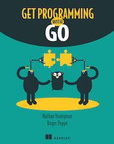

.. gwpcn.com documentation master file, created by
   sphinx-quickstart on Sun May 14 09:15:18 2017.
   You can adapt this file completely to your liking, but it should at least
   contain the root `toctree` directive.

《Get Programming with Go》中文版
=========================================

欢迎来到《Get Programming with Go》中文版的读者服务网站！

本书将以循序渐进的方式讲解高效使用 Go 所必需的概念，并提供大量练习来磨砺你的技能。 
这是一本初学者指南，旨在从头到尾地进行阅读，并且每个课程都建立在前面课程的基础之上。 
本书虽然没有完整地描述 Go 的所有语言特性，但是却涵盖了其中的绝大部分特性，并且提及了面向对象设计以及并发等高级主题。

无论你是打算使用 Go 编写大型的并发 web 服务，还是说只想用 Go 编写小型脚本和简单的工具，本书都会帮助你打下坚实的基础。

发售信息
---------------

《Get Programming with Go》中文版由人民邮电出版社引进，黄健宏负责翻译。

书本目前译稿已经完成，
预计将于本月交稿，
具体的发售日期待定。

关注本书发售信息的朋友请定期访问本站，
又或者关注译者的\ `微博 <http://weibo.com/huangz1990>`_\ 或 \ `twitter <https://twitter.com/huangz1990>`_\  。

目录
--------------

| 译者序
| 译者简介
| 前言
| 致谢
| 关于本书
| 关于作者

**单元 0：入门**

- 第 1 课：各就各位，预备，跑！
  
  - 1.1 什么是 Go ？
  - 1.2 Go 游乐场
  - 1.3 包和函数
  - 1.4 唯一无二的大括号风格
  - 1.5 课后小结

**单元 1：命令式编程**

- 第 2 课：被美化的计算器

  - 2.1 执行计算
  - 2.2 格式化输出
  - 2.3 常量和变量
  - 2.4 走捷径
  - 2.5 数字游戏
  - 2.6 课后小结

- 第 3 课：循环和分支

  - 3.1 真或假
  - 3.2 比较
  - 3.2 使用 ``if`` 实现分支判断
  - 3.4 逻辑运算符
  - 3.5 使用 ``switch`` 实现分支判断
  - 3.6 使用循环实现重复执行
  - 3.7 课后小结

- 第 4 课：变量作用域
  
  - 4.1 审视作用域
  - 4.2 简短声明
  - 4.3 作用域的范围
  - 4.4 课后小结

- 第 5 课：单元实验——前往火星的航行票

**单元 2：类型**

- 第 6 课：实数

  - 6.1 声明浮点数变量
  - 6.2 打印浮点数类型
  - 6.3 浮点精确性
  - 6.4 比较浮点数
  - 6.5 课后小结

- 第 7 课：整数

  - 7.1 声明整数变量
  - 7.2 为 8 位颜色使用 uint8 类型
  - 7.3 整数回绕
  - 7.4 课后小结

- 第 8 课：大数

  - 8.1 击中天花板
  - 8.2 big 包
  - 8.3 大小非同寻常的变量
  - 8.4 课后小结

- 第 9 课：多语言文本

  - 9.1 声明字符串变量
  - 9.2 字符、代码点、符文和字节
  - 9.3 拉弦
  - 9.4 使用凯撒加密法处理字符
  - 9.5 将字符串解码为符文
  - 9.6 课后小结

- 第 10 课：类型转换

  - 10.1 类型不能混合使用
  - 10.2 数字类型转换
  - 10.3 类型转换的危险之处
  - 10.4 字符串转换
  - 10.5 转换布尔值
  - 10.6 课后小结

- 第 11 课：单元实验——维吉尼亚加密法

**单元 3：构建块**

- 第 12 课：函数

  - 12.1 函数声明
  - 12.2 编写函数
  - 12.3 课后小结

- 第 13 课：方法

  - 13.1 声明新类型
  - 13.2 引入自定义类型
  - 13.3 通过方法为类型添加行为
  - 13.4 课后小结

- 第 14 课：第一类函数

  - 14.1 将函数赋值给变量
  - 14.2 将函数传递给其他函数
  - 14.3 声明函数类型
  - 14.4 闭包和匿名函数
  - 14.5 课后总结

- 第 15 课：单元实验——温度表

**单元 4：收集器**

- 第 16 课：劳苦功高的数组
  
  - 16.1 声明数组并访问它们的元素
  - 16.2 小心越界
  - 16.3 使用复合字面量初始化数组
  - 16.4 迭代数组
  - 16.5 被复制的数组
  - 16.6 由数组组成的数组
  - 16.7 课后小结

- 第 17 课：切片——朝向数组的窗口

  - 17.1 分割数组
  - 17.2 切片的复合字面量
  - 17.3 切片的威力
  - 17.4 带有方法的切片
  - 17.5 课后小结

- 第 18 课：更大的切片

  - 18.1 ``append`` 函数
  - 18.2 长度和容量
  - 18.3 详解 ``append`` 函数
  - 18.4 三索引切片操作
  - 18.5 使用 ``make`` 对切片实行预分配
  - 18.6 声明可变参数函数
  - 18.7 课后小结

- 第 19 课：无所不能的映射

  - 19.1 声明映射
  - 19.2 映射不会被拷贝
  - 19.3 使用 ``make`` 实行映射预分配
  - 19.4 使用映射进行计数
  - 19.5 使用映射和切片实现数据分组
  - 19.6 将映射用作集合
  - 19.7 课后小结

- 第 20 课：单元实验——切片人生

  - 20.1 开天辟地
  - 20.2 适者生存
  - 20.3 平行世界

**单元 5：状态与行为**

- 第 21 课：结构

  - 21.1 声明结构
  - 21.2 通过类型重用结构
  - 21.3 通过复合字面量初始化结构
  - 21.4 结构将被复制
  - 21.5 由结构组成的切片
  - 21.6 将结构编码为 JSON
  - 21.7 使用结构标签定制 JSON
  - 21.8 课后小结

- 第 22 课：Go 没有类

  - 22.1 将方法绑定至结构
  - 22.2 构造函数
  - 22.3 类的替代品
  - 22.4 课后小结

- 第 23 课：组合与转发

  - 23.1 合并结构
  - 23.2 方法转向
  - 23.3 命名冲突
  - 23.4 课后小结

- 第 24 课：接口

  - 24.1 接口类型
  - 24.2 探索接口
  - 24.3 满足接口
  - 24.4 课后小结

- 第 25 课：单元实验——火星上的动物避难所

**单元 6：深入 Go 语言**

- 第 26 课：关于指针的二三事

  - 26.1 & 和星号
  - 26.2 指针的作用就是指向
  - 26.3 实现修改
  - 26.4 隐式指针
  - 26.5 指针和接口
  - 26.6 明智地使用指针
  - 26.7 课后小结

- 第 27 课：关于 nil 的纷纷扰扰

  - 27.1 通向惊恐的空指针
  - 27.2 保护你的方法
  - 27.3 Nil 函数值
  - 27.4 Nil 切片
  - 27.5 Nil 映射
  - 27.6 Nil 接口
  - 27.7 Nil 之外的另一个选择
  - 27.8 课后小结

- 第 28 课：孰能无过

  - 28.1 处理错误
  - 28.2 优雅地错误处理
  - 28.3 新的错误
  - 28.4 不要惊恐
  - 28.5 课后小结

- 第 29 课：单元实验——数独规则

**单元 6：并发编程**

- 第 30 课：Goroutine 与并发

  - 30.1 启动 goroutine
  - 30.2 不止一个 goroutine
  - 30.3 通道
  - 30.4 使用 SELECT 处理多个通道
  - 30.5 阻塞和死锁
  - 30.6 囊地鼠装配线
  - 30.7 课后小结

- 第 31 课：并发状态

  - 31.1 互斥
  - 31.2 长时间运行的工作进程
  - 31.3 课后小结

- 第 32 课：单元实验——寻找火星生命

  - 32.1 可供活动的网格
  - 32.2 报告发现

| 结语：何去何从
| 附录：参考答案
| 索引

对本书的赞誉
-----------------

*这本书的组织方式对于快速学习 Go 来说堪称完美，
它对那些没有经验的程序员尤为有用。* 
—— MARIO CARRION ，MEREDITH 公司

*这是一本注重实践的书。 
书中包含的大量示例将帮助你学习 Go 语言的核心知识， 
并教会你 Go 语言常见的惯例用法。*
—— ULISES FLYNN ，NAV 公司

*一本关于 Go 的好书。 
为初学者而写， 
但是对经验丰富的开发者也会有所帮助。*
—— MIKAËL DAUTREY ，ISITIX 公司

*成功攀登 Go 高峰的第一步。*
—— JEFF SMITH ，AGILIFY 公司

作者简介
------------------

.. image:: image/NATHAN.jpg

NATHAN YOUNGMAN （内森·扬曼）既是一位自学成才的网络开发者，也是终生学习概念的一位践行者。
他是加拿大埃德蒙顿市 Go 聚会的组织者，加拿大代码教育（Canada Learning Code）机构的导师以及地鼠玩偶的狂热摄影爱好者。

.. image:: image/ROGER.jpg

ROGER PEPPÉ （罗杰·乔）是一位 Go 贡献者，他维护着一系列开源 Go 项目，运营着英国纽卡斯尔市的 Go 聚会，并且当前正在担任 Go 云端基础设施软件的相关工作。

译者简介
------------------

.. image:: image/huangz.jpeg
   :scale: 30%

黄健宏（huangz）是一位 IT 技术图书作译者。
他著有《Redis使用手册》和《Redis设计与实现》，译有《Go Web 编程》和《Redis实战》。
关于他的更多信息请访问 `huangz.me <http://huangz.me>`_ 。

相关资源
--------------

`《Get Programming with Go》在 Manning 出版社的主页 <https://www.manning.com/books/get-programming-with-go>`_

`《Get Programming with Go》的配套源码 <https://github.com/nathany/get-programming-with-go>`_

`《Get Programming with Go》原文试读 <https://livebook.manning.com/book/get-programming-with-go/>`_

