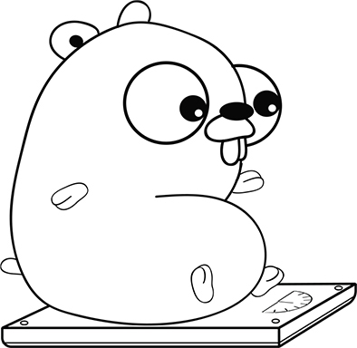

第 2 章：被美化的计算器
============================

阅读本课程能够帮助你：

-  学会如何让计算机执行算术操作
-  学会如何声明变量和常量
-  了解声明和赋值的区别
-  学会如何使用标准库生成伪随机数

计算机程序能够胜任相当多的工作。
作为例子，本课程将展示如何使用程序去解决数学问题。

   {请考虑这一点}

   我们为什么要编写程序来做那些只需要按一下计算器就能够解决的问题呢？

   首先，人类的记性通常都不太好，可能无法精确地记下光的速度又或者火星沿着轨道环绕太阳一周所需的时间，而程序和计算机就没有这个问题。
   其次，代码可以保存起来以供之后阅读，它既是一个计算器也是一份参考说明。
   最后，程序是可执行文件，人们可以随时根据自己的需要来共享和修改它。

2.1 执行计算
------------

人们总是希望自己能够变得更年轻和更苗条，如果你也有同样的想法，那么火星应该能满足你的愿望。
火星上的一年相当于地球的 687
天，而相对较弱的地心引力则使得同一物体在火星上的重量只有地球上的 38% 。

为了计算本书作者 Nathan 在火星上的年龄和体重，我们写下了代码清单 2-1
所示的小程序。 Go 跟其他编程语言一样，提供了 ``+`` 、 ``-`` 、 ``*`` 、
``/`` 和 ``%``
等算术\ *操作符*\ ，并将它们分别用于执行加法、减法、乘法、除法和取模运算。

   {提示}

   取模运算符 ``%`` 能够计算出两个整数相除所得的余数。 比如说，``42 % 10`` 的结果为 ``2`` 。

--------------

代码清单 2-1 你好，火星： ``mars.go``

::

    // My weight loss program.                              // 为人类读者提供的注释
    package main

    import "fmt"

    // main is the function where it all begins.            // 为人类读者提供的注释
    func main() {
        fmt.Print("My weight on the surface of Mars is ")
        fmt.Print(149.0 * 0.3783)                           // 打印出 56.3667
        fmt.Print(" lbs, and I would be ")
        fmt.Print(41 * 365 / 687)                           // 打印出 21
        fmt.Print(" years old.")
    }

--------------

   {注意}

   虽然代码清单 2-1 会以英镑为单位打印体重，
   但计量单位的选择对于体重的计算并无影响。 无论你使用的是什么计量单位，
   火星上的重量都只相当于地球上重量的 38% 。

这段代码的第一行为注释。 当 Go 在代码里面发现双斜线 ``//``
的时候，它会忽略双斜线之后直到行尾为止的所有内容。
计算机编程的本质就是交流，好的代码不仅能够把程序员的指令传达给计算机，还能够把程序员的意图传达给其他阅读代码的人。
注释的存在纯粹是为了帮助人类理解代码的意图，它不会对程序的行为产生任何影响。

上面的代码清单会调用 ``Print``
函数好几次，以便将完整的句子打印在同一行里面。
达到这一目的的另一种方法是调用 ``Println``
函数，并向它传递一组由逗号分隔的\ *参数*\ ，这些参数可以是文本、数字又或者算术\ *表达式*\ ：

.. code:: go

   fmt.Println("My weight on the surface of Mars is", 149.0*0.3783, "lbs, and I would be", 41*365.2425/687, "years old.")

    // 这个函数调用将打印出句子“My weight on the surface of Mars is 56.3667 lbs, and I would be 21.79758733624454 years old.”

--------------

   {速查 2-1}

   请在 Go 游乐场 play.golang.org 中输入并运行代码清单 2-1 ，
   然后将作者的年龄（41）以及重量（149.0）替换成自身的年龄和重量，
   看看你在火星上的年龄和重量是多少？

..

   {速查 2-1 答案} 

   这个问题没有标准答案，
   程序的具体输出取决于你输入的重量和年龄。

..

   {提示}

   在修改代码之后，请点击 Go 游乐场中的“格式化（Format）”按钮。
   这样游乐场就会在不改变代码行为的前提下，自动重新格式化代码的缩进和空白。

2.2 格式化输出
--------------

通过使用代码清单 2-2 中展示的 ``Printf``
函数，用户可以在文本中的任何位置插入给定的值。 ``Printf`` 函数跟
``Print`` 函数以及 ``Println``
函数同属一门，但前者对输出拥有更大的控制权。

--------------

代码清单 2-2 Printf: ``fmt.go``

::

    fmt.Printf("My weight on the surface of Mars is %v lbs,", 149.0*0.3783) // 打印出“My weight on the surface of Mars is 56.3667 lbs,”

    fmt.Printf(" and I would be %v years old.\n", 41*365/687)               // 打印出“and I would be 21 years old.”

--------------

跟 ``Print`` 和 ``Println`` 不一样的是，\ ``Printf``
接受的第一个参数总是文本，第二个参数则是表达式，而文本中包含的\ *格式化变量*
``%v`` 则会在之后被替换成表达式的\ *值*\ 。

   {注意}

   之后的课程将按需介绍更多除 ``%v`` 之外的其他格式化变量，
   你也可以通过查看文档 golang.org/pkg/fmt/
   得到完整的格式化变量参考列表。

虽然 ``Println`` 会自动将输出的内容推进至下一行，但 ``Printf`` 和
``Print`` 却不会那么做。
对于后面这两个函数，用户可以通过在文本里面放置换行符 ``\n``
来将输出内容推进至下一行。

如果用户给定了多个格式化变量，那么 ``Printf``
函数将按顺序把它们替换成相应的值：

--------------

.. code:: go

   fmt.Printf("My weight on the surface of %v is %v lbs.\n", "Earth", 149.0)

    // 打印出“My weight on the surface of Earth is 149 lbs.”

--------------

``Printf``
除了可以在句子的任意位置将格式化变量替换成指定的值之外，还能够调整文本的位置。
比如说，用户可以通过给定带有宽度的格式化变量 ``%4v``
，将文本的长度填充至 4 个字符长。
当宽度为正数时，空格将被填充至文本左边，而当宽度为负数时，空格将被填充至文本右边：

.. code:: go

   fmt.Printf("%-15v $%4v\n", "SpaceX", 94)
   fmt.Printf("%-15v $%4v\n", "Virgin Galactic", 100)

上面这两行代码将打印出以下内容：

::

   SpaceX          $  94
   Virgin Galactic $ 100

..

   {速查 2-2}

   1. 如何才能打印出一个新行？
   2. ``Printf`` 函数在遇到格式化变量 ``%v`` 的时候会产生何种行为？

..

   {速查 2-2 答案}

   1. 你可以在待打印文本的任意位置通过添加 ``\n``
      字符来插入新行，又或者直接调用 ``fmt.Println()`` 。
   2. 格式化变量 ``%v`` 将被替换成用户在后续参数中给定的值。

2.3 常量和变量
--------------

代码清单 2-1 中的计数器在计算时使用了类似 0.3783
这样的\ *字面*\ 数字，但并没有具体说明这些数字所代表的的含义，程序员有时候会把这种没有说明具体含义的字面数字称之为\ *魔数*\ 。
通过使用常量和变量并为字面数字赋予描述性的名称，我们可以有效地减少魔数的存在。

在了解过居住在火星对于年龄和体重有何种好处之后，我们接下来要考虑的就是旅行所需消耗的时长。
对于我们的旅程来说，光速旅行是最为理想的。
因为光在太空的真空环境中会以\ *固定*\ 速度传播，所以相应的计算将会变得较为简单。
与此相反的是，根据行星在太阳轨道上所处的位置不同，地球和火星之间的距离将会产生相当大的\ *变化*\ 。

代码清单 2-3 引入了两个新的关键字 ``const`` 和 ``var``
，它们分别用于声明常量和变量。

--------------

代码清单 2-3 实现光速旅行： ``lightspeed.go``

::

    // How long does it take to get to Mars?
    package main

    import "fmt"

    func main() {
        const lightSpeed = 299792 // km/s
        var distance = 56000000   // km

        fmt.Println(distance/lightSpeed, "seconds") // 打印出“186 seconds”

        distance = 401000000
        fmt.Println(distance/lightSpeed, "seconds") // 打印出“1337 seconds”
     }

--------------

只要将代码清单 2-3 中的代码输入至 Go
游乐场然后点击运行按钮，我们就可以计算出从地球出发到火星所需的时间了。
能够以光速前进是一件非常便捷的事情，不消一会儿工夫你就到达了目的地，你甚至都不会听到有人抱怨说“我们怎么还没到？”。

这段代码的第一次计算通过声明 ``distance`` 变量并为其赋予初始值
56,000,000
公里来模拟火星与地球相邻时的情形，而在进行第二次计算的时候，则通过为
``distance`` 变量赋予新值 401,000,000
公里来模拟火星和地球分列太阳两侧时的情形（其中 401,000,000
公里代表的是火星和地球之间的直线距离）。

   {注意}

   ``lightSpeed`` 常量是不能被修改的， 尝试为其赋予新值将导致 Go
   编译器报告错误：“无法对 ``lightSpeed`` 进行赋值”。

..

   {注意}

   变量必须先声明后使用。 如果变量尚未使用 ``var`` 关键字进行声明，
   那么尝试向它赋值将导致 Go 报告错误， 比如在前面的代码中执行
   ``speed = 16`` 就会这样。 这一限制有助于发现类似“想要向 ``distance``
   赋值结果却键入了 ``distence``”这样的问题。

..

   {速查 2-3}

   1. 尽管 SpaceX 公司的星际运输系统因为缺少曲速引擎而无法以光速行进，
      但它仍然能够以每小时 100,800 公里这一可观的速度驶向火星。
      如果这个雄心勃勃的公司在 2025 年的一月份，
      也即是地球和火星之间相距 96,300,000 公里远的时候发射宇宙飞船，
      那么它需要用多少天才能够到达火星？ 请修改代码清单 2-3
      来计算并回答这一问题。
   2. 在地球上， 一天总共有 24 个小时。 如果要在程序中为数字 24
      指定一个描述性的名字， 你会用什么关键字？

..

   {速查 2-3 答案}

   1. 虽然宇宙飞船在实际中不可能只沿着直线行进， 但作为一个粗略的估计，
      它从地球飞行至火星大约需要用 39 天。
      以下是进行计算所需修改的代码：

      .. code:: go

         const hoursPerDay = 24
         var speed = 100800      // 公里/小时
         var distance = 96300000 // 公里
         fmt.Println(distance/speed/hoursPerDay, "days")

   2. 因为地球一天拥有的小时数不太可能在程序运行的过程中发生变化，
      所以我们可以使用 ``const`` 关键字来定义它。

2.4 走捷径
-----------------

虽然访问火星也许没有捷径可走，但 Go
却提供了一些能够让我们少打些字的快捷方式。

2.4.1 一次声明多个变量
~~~~~~~~~~~~~~~~~~~~~~

用户在声明变量或者常量的时候，既可以在每一行中单独声明一个变量：

.. code:: go

   var distance = 56000000
   var speed = 100800

也可以打包声明多个变量：

.. code:: go

   var (
        distance = 56000000
        speed = 100800
   )

又或者在同一行中声明多个变量：

.. code:: go

   var distance, speed = 56000000, 100800

需要注意的是，为了保证代码的可读性，我们在打包声明多个变量或者将多个变量放在同一行之前，应该先考虑这些变量是否相关。

   {速查 2-4}

   请在只使用一行代码的情况下，
   同时定义出一天的小时数以及每小时的分钟数。

..

   {速查 2-4 答案}

   ``const hoursPerDay, minutesPerHour = 24, 60``

2.4.2 增量并赋值操作符
~~~~~~~~~~~~~~~~~~~~~~

有几种快捷方式可以让我们在赋值的同时执行一些操作。
比如以下代码清单中的最后两行就是等效的：

--------------

代码清单 2-4 赋值操作符： ``shortcut.go``

.. code:: go

   var weight = 149.0
   weight = weight * 0.3783
   weight *= 0.3783

--------------

Go 为加一操作提供了额外的快捷方式，它们的执行方式如下：

--------------

代码清单 2-5 加法操作符

::

    var age = 41
    age = age + 1   // 生日快乐！
    age += 1
    age++

--------------

用户可以使用 ``count--`` 执行减一操作，又或者使用类似 ``price /= 2``
这样的方式执行其他常见的算术运算。

   {注意}

   顺带一提， Go 并不支持 ``++count`` 这种见诸于 C 和 JAVA
   等语言中的前置加法操作。

..

   {速查 2-5}

   请用最简短的代码实现“从 ``weight`` 变量中减去两磅”这一操作。

..

   {速查 2-5 答案}

   ``weight -= 2``

2.5 数字游戏
------------

让人类随意想出一个介于 1 至 10 之间的数字是非常容易的，但如果我们想要让
Go 来完成同样的事情，那么就需要用到 ``rand`` 包来生成伪随机数。
这些数字之所以被称为伪随机数，是因为它们并非真正随机，只是看上去像是随机的而已。

代码清单 2-6 中的代码会打印出两个介于 1 至 10 之间的数字。
这个程序会先向 ``Intn`` 函数传入数字 ``10`` 以获得一个介于 0 至 9
之间的伪随机数，然后把这个数字加一并将其结果赋值给变量 ``num`` 。
因为常量无法使用函数调用的结果作为值，所以 ``num``
被声明成了变量而不是常量。

   {注意}

   如果我们在写代码的时候忘记对伪随机数执行加一操作，
   那么程序将返回一个介于 0 至 9 的数字而不是我们想要的介于 1 至 10
   的数字。 这是典型的计算机编程错误差一错误（off-by-one
   error）的其中一个例子。

   这种错误是典型的计算机编程错误之一。

--------------

代码清单 2-6 随机数字： ``rand.go``

::

    package main

    import (
        "fmt"
        "math/rand"
    )

    func main() {
        var num = rand.Intn(10) + 1
        fmt.Println(num)

        num = rand.Intn(10) + 1
        fmt.Println(num)
    }

--------------

虽然 ``rand`` 包的\ *导入路径*\ 为 ``math/rand`` ，但是我们在调用
``Intn`` 函数的时候只需要使用包名 ``rand``
作为前缀即可，不需要使用整个导入路径。

   {提示}

   从原则上来讲， 我们在使用某个包之前必须先通过 ``import``
   关键字导入该包， 但是贴心的 Go
   游乐场也可以在有需要的时候自动为我们添加所需的导入语句。 为此，
   你需要确保游乐场中的“Imports”（导入）点击框已经处于打勾状态，
   并点击游乐场中的“Format”（格式化）按钮。 这样一来， Go
   游乐场就会找出程序正在使用的包， 然后更新代码以添加相应的导入语句。

..

   {注意}

   因为 Go 游乐场会把每个程序的执行结果都缓存起来，
   所以即使我们重复执行代码清单 2-6 所示的程序，
   最终也只会得到相同的结果，
   不过能够做到这一点已经足以验证我们的想法了。

..

   {速查 2-6}

   地球和火星相邻时的距离和它们分列太阳两侧时的距离是完全不同的。
   请编写一个程序， 它能够随机地生成一个介于 56,000,000 公里至
   401,000,000 公里之间的距离。

..

   {速查 2-6 答案}

   .. code:: go

      // 随机地产生一个从地球到火星之间的距离（以公里为单位）
      var distance = rand.Intn(345000001) + 56000000
      fmt.Println(distance)

2.6 课后小结
------------

-  ``Print`` 、 ``Println`` 和 ``Printf``
   函数都可以将文本和数字打印到屏幕上。

-  通过 ``Printf`` 函数和格式化变量 ``%v``
   ，用户可以将值放置到被打印文本的任意位置上。

-  ``const`` 关键字声明的是常量，它们无法被改变。

-  ``var`` 关键字声明的是变量，它们可以在程序运行的过程中被赋予新值。

-  ``rand`` 包的导入路径为 ``math/rand`` 。

-  ``rand`` 包中的 ``Intn`` 函数可以生成伪随机数。

-  到目前为止，我们已经使用了 Go 25 个关键字中的 5 个，它们分别是：
   ``package`` 、 ``import`` 、 ``func`` 、 ``const`` 和 ``var`` 。

为了检验你是否已经掌握了上述知识，请尝试完成以下实验。

实验： ``malacandra.go``
~~~~~~~~~~~~~~~~~~~~~~~~

   Malacandra 并不遥远， 我们大约只需要二十八天就可以到达那里。 ——
   C.S.Lewis ，《沉寂的星球》

*Malacandra* 是 C.S.Lewis 在《太空三部曲》中为火星取的别名。
请编写一个程序，计算出在距离为 56,000,000
公里的情况下，宇宙飞船需要以每小时多少公里的速度飞行才能够只用 28
天就到达 Malacandra 。

请将你的解答和附录中列出的参考答案进行对比。
