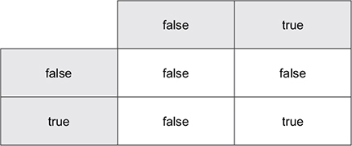

第 3 章：循环和分支
==========================

阅读本课程能够帮助你：

-  学会如何让计算机通过 ``if`` 和 ``switch`` 做选择

-  学会使用 ``for`` 重复执行指定的代码

-  学会基于条件实现循环和分支处理

计算机程序很少能够像小说那样从开头一直读到结尾，它们更像是那种能够自选结局的故事书和交互小说，后者可以基于特定条件选择不同路径，又或者重复相同步骤直到满足指定条件为止。

如果你对 ``if`` 、 ``else`` 以及 ``for``
这三个见诸于多种编程语言的关键字已经非常熟悉，那么可以把本课程看作是 Go
语法的快速简介。

   {请考虑这一点}

   作者 Nathan 年轻时跟家人一起长途旅行的时候，
   会一起玩“二十个问题”（Twenty Questions）游戏来消磨时间：
   一个人心里要想着一样东西，
   而其他人则通过提问的方式来猜测这个东西是什么，
   并且被提问的人只能回答“是”或者“不是”。
   类似“它有多大？”这样的问题是无法回答的，
   更常见的问法是“它比烤面包机要大吗？”。

   计算机程序同样基于是/否问题执行操作。
   对于类似“是否比烤面包机要大”这样的条件，
   计算机处理器要么继续执行后续步骤， 要么通过 ``JMP``
   指令跳转至程序的其他位置，
   至于复杂的决策则会被分解成多个更小和更简单的条件。

   以你今天所穿的衣服为例， 你是如何挑选每一件衣服的呢，
   其中又取决于哪些因素？
   你是根据天气预报、当天的活动计划、衣服是否完好或者是否潮流来挑选衣服的吗，
   又或者你只是随心所欲地挑选了一套， 根本没考虑那么多？
   如果你要写一个程序来决定早上如何穿衣打扮的话，
   那么你会提出哪些只能回答“是”或者“否”的问题呢？

3.1 真或假
----------

在阅读能够自选结局的故事书时，你会碰到类似以下这样的选择：

   如果你选择走出洞穴， 那么请翻到第 21 页。 —— Edward
   Packard，《时间的洞穴》

在 Go 中，诸如“是否走出洞穴”这样的问题可以用 ``ture`` 和 ``false``
这两个预定义常量来回答。 你可以像这样使用这两个常量：

.. code:: go

   var walkOutside = true
   var takeTheBluePill = false

..

   {注意}

   某些编程语言对于“真”的定义比较宽松。 比如 Python 和 JavaScript
   就把空文本 ``""`` 和数字零看作是“假”， 但是 Ruby 和 Elixir
   却把这两个值看作是“真”。 对于 Go 来说， ``true`` 是唯一的真值， 而
   ``flase`` 则是唯一的假值。

为了纪念 19 世纪时的数学家乔治·布尔，我们把“真”和“假”称为\ *布尔*\ 值。
Go 的标准库里面有好些函数都会返回布尔值。 比如在接下来的代码清单 3-1
里面，程序就使用了 ``strings`` 包中的 ``Contains`` 函数来检查
``command``
变量是否包含单词“outside”，并且由于这一问题的答案为真，所以函数将返回
``true`` 作为结果。

--------------

代码清单 3-1 返回布尔值的函数： ``contains.go``

::

    package main

    import (
        "fmt"
        "strings"
    )

    func main() {
        fmt.Println("You find yourself in a dimly lit cavern.")

        var command = "walk outside"
        var exit = strings.Contains(command, "outside")

        fmt.Println("You leave the cave:", exit)    // 打印文本“You leave the cave: true”
     } 

--------------

   {速查 3-1}

   1. 如果洞穴里面出现了令人目眩的正午阳光， 你该如何声明名为
      ``wearShades`` 的布尔变量呢？

   2. 如果洞穴入口附近有一个指示牌，

   你该如何判断 ``command`` 变量是否包含单词 ``"read"`` 呢？

..

   {速查 3-2 答案}

   1. ``var wearShades = true``

   2. ``var read = strings.Contains(command, "read")``

3.2 比较
--------

比较两个值是得出 ``true`` 或者 ``false`` 的另一种方式。 Go 提供了表 3-1
所示的比较运算符。

--------------

表 3-1 比较运算符

=============== ===============
``==`` 相等     ``!=`` 不相等
=============== ===============
``<`` 小于      ``>`` 大于
``<=`` 小于等于 ``>=`` 大于等于
=============== ===============

--------------

表 3-1 中的运算符既可以比较文本，又可以比较数字。 比如下面的代码清单 3-2
就展示了一个比较数字的例子。

--------------

代码清单 3-2 比较数字： ``compare.go``

::

    fmt.Println("There is a sign near the entrance that reads 'No Minors'.")

    var age = 41
    var minor = age < 18

    fmt.Printf("At age %v, am I a minor? %v\n", age, minor)

--------------

运行这个代码清单，我们将得到以下输出：

.. code-block:: text

   There is a sign near the entrance that reads 'No Minors'.
   At age 41, am I a minor? false

..

   {注意}

   JavaScript 和 PHP
   都提供了特殊的\ *三等号*\ （\ *threequals*\ ）运算符来实现严格的相等性检查。
   在这些语言中， 宽松检查 ``"1" == 1`` 的结果为真， 而严格检查
   ``"1"  ===  1`` 的结果则为假。 Go 只提供了一个相等运算符，
   并且它不允许直接比较文本和数字。 本书将在第 10
   课演示如何将数字转换为文本， 以及如何将文本转换为数字。

..

   {速查 3-2}

   ``"apple"`` 和 ``"banana"`` 这两个单词， 哪个更大一些？

..

   {速查 3-2 答案}

   因为语句 ``fmt.Println("apple" > "banana")`` 的执行结果为 ``false``
   ， 所以单词 ``"banana"`` 比单词 ``"apple"`` 要大。

3.2 使用 ``if`` 实现分支判断
----------------------------

正如代码清单 3-3 所示，计算机可以使用布尔值或者比较条件，在 ``if``
语句中选择不同的执行路径。

--------------

代码清单 3-3 分支： ``if.go``

::

    package main

    import "fmt"

    func main() {
        var command = "go east"

        if command == "go east" {           // 检查命令是否为“go east”
             fmt.Println("You head further up the mountain.")
        } else if command == "go inside" {  // 在第一次检查为假之后，检查命令是否为“go inside”
             fmt.Println("You enter the cave where you live out the rest of your life.")
        } else {                            // 如果前两次检查都为假，那么执行第三个分支
             fmt.Println("Didn't quite get that.")
        }
    }

--------------

执行代码清单 3-3 ，我们将得到以下输出：

::

   You head further up the mountain.

``else if`` 语句和 ``else`` 语句都是可选的。
当有多个分支路径可选时，你可以重复使用 ``else if`` 直到满足需要为止。

   {注意}

   如果你张冠李戴地误用了赋值操作符 ``=`` 来代替相等运算符 ``==`` ，
   那么 Go 将报告一个错误。

..

   {速查 3-3}

   冒险游戏通常会使用不同的空间作为场景。 请编写一个程序， 它使用 ``if``
   和 ``else if`` 分别打印出洞穴、入口和大山这三个空间的描述。
   在编写程序的过程中， 请记得一定要像代码清单 3-3 那样， 根据 Go
   唯一合法的括号风格来放置大括号 ``{}`` 。

..

   {速查 3-3 答案}

   .. code:: go

      package main 
      import "fmt" 
      func main() {
            var room = "cave"
            if room == "cave" {
                    fmt.Println("You find yourself in a dimly lit cavern.")
            } else if room == "entrance" {
                    fmt.Println("There is a cavern entrance here and a path to the east.")
            } else if room == "mountain" {
                    fmt.Println("There is a cliff here. A path leads west down the mountain.")
            } else {
                fmt.Println("Everything is white.")
            } 
      }

3.4 逻辑运算符
--------------

在 Go 中，逻辑运算符 ``||`` 代表“*逻辑或*”，而逻辑运算符 ``&&``
则代表“*逻辑与*”。 这些逻辑运算符可以一次检查多个条件，图 3-1 和 3-2
展示了它们的求值方式。

--------------

图 3-1 逻辑或：当 ``a`` 、 ``b`` 两值中至少有一个为真时， ``a || b`` 为真

.. image:: image/lession3/3-1.jpg

|

图 3-2 逻辑与：当且仅当 ``a`` 、 ``b`` 两值都为真时， ``a && b`` 为真

--------------

代码清单 3-4 展示的是一段判断 2100
年是否为闰年的程序，其中用到的判断指定年份是否为闰年的规则如下：

-  能够被 4 整除但是不能被 100 整除的年份为闰年

-  可以被 400 整除的年份也是闰年

..

   {注意}

   正如之前所说， 取模运算符 ``%`` 可以计算出两个整数相除时所得的余数，
   而余数为零则表示一个数被另一个数整除了。

.. image:: image/lession3/gopher.jpg

--------------

代码清单 3-4 闰年识别器： ``leap.go``

::

    fmt.Println("The year is 2100, should you leap?")

    var year = 2100
    var leap = year%400 == 0 || (year%4 == 0 && year%100 != 0)

    if leap {
        fmt.Println("Look before you leap!")
    } else {
        fmt.Println("Keep your feet on the ground.")
    }

--------------

执行代码清单 3-4 中的程序将得到以下输出：

.. code-block:: text

   The year is 2100, should you leap?
   Keep your feet on the ground.

跟大多数编程语言一样，Go 也采用了\ *短路逻辑*\ ： 如果位于 ``||``
运算符之前的第一个条件为真，那么位于运算符之后的条件就可以被忽略，没有必要再对其进行求值。
具体到代码清单 3-4 中的例子，当给定年份可以被 400
整除时，程序就不必再进行后续的判断了。

``&&`` 运算符的行为跟 ``||`` 运算符正好相反：
只有在两个条件都为真的情况下，运算结果才会为真。 对于代码清单 3-4
中的例子，如果给定年份无法被 4 整除，那么程序就不会求值后续条件。

*逻辑非*\ 运算符 ``!`` 可以将一个布尔值从 ``false`` 转变为 ``true``
，又或者将 ``true`` 转变为 ``false`` 。 作为例子，代码清单 3-5
将在玩家没有火把或者未点燃火把时打印出一条信息。

--------------

代码清单 3-5 逻辑非运算符： ``torch.go``

::

    var haveTorch = true
    var litTorch = false

    if !haveTorch || !litTorch {
        fmt.Println("Nothing to see here.") // 打印出“Nothing to see here.”
    }

--------------

   {速查 3-4}

   1. 首先请使用纸和笔， 将代码清单 3-4 中闰年表达式的年份替换为
      ``2000`` ； 接着求值所有取模运算，
      计算出它们的余数（如果有需要可以使用计算器）； 在此之后， 求值
      ``==`` 和 ``!=`` 条件以得出 ``true`` 或者 ``false`` ； 最后，
      求值逻辑运算符 ``&&`` 和 ``||`` ， 并最终判断出 2000
      年是否为闰年。
   2. 如果我们在求值 ``2000%400 == 0`` 为 ``true`` 时使用短路逻辑，
      是不是就可以节省一些时间了？ —

..

   {速查 3-4 答案}

   1. 是的， 2000 年的确是闰年：

      .. code:: go

          2000%400 == 0 || (2000%4 == 0 && 2000%100 != 0) 0 == 0 || (0 == 0 && 0 != 0)
          true || (true && false)
          true || (false)
          true

   2. 是的， 计算并写下等式的后半部分需要花费额外的时间。
      虽然计算机执行相同计算的速度要快得多，
      但短路逻辑仍然能够起到节约时间的作用。

3.5 使用 ``switch`` 实现分支判断
--------------------------------

正如代码清单 3-6 所示，Go 提供了 ``switch``
语句，它可以将一个值和多个值进行比较。

--------------

代码清单 3-6 ``switch`` 语句： ``concise-switch.go``

::

    fmt.Println("There is a cavern entrance here and a path to the east.")
    var command = "go inside"

    switch command {    // 将命令和给定的多个分支进行比较
    case "go east":
        fmt.Println("You head further up the mountain.")
    case "enter cave", "go inside":     // 使用逗号分隔可选值
        fmt.Println("You find yourself in a dimly lit cavern.")
    case "read sign":
        fmt.Println("The sign reads 'No Minors'.")
    default:
        fmt.Println("Didn't quite get that.")
    }

--------------

执行这个程序将产生以下输出：

::

   There is a cavern entrance here and a path to the east.
   You find yourself in a dimly lit cavern.

..

   {注意}

   除了文字以外， ``switch`` 语句还可以接受数字作为条件。

``switch`` 的另一种用法是像 ``if...else``
那样，在每个分支中单独设置比较条件。 正如代码清单 3-7 所示，\ ``switch``
还拥有独特的 ``fallthrough`` 关键字，它可以用于执行下一分支的代码。

--------------

代码清单 3-7 ``switch`` 语句： ``switch.go``

::

    var room = "lake"

    switch {    // 比较表达式将被放置到单独的分支里面。
    case room == "cave":
        fmt.Println("You find yourself in a dimly lit cavern.")
    case room == "lake":
        fmt.Println("The ice seems solid enough.")
        fallthrough    // 下降（fall through）至下一分支。
    case room == "underwater":
        fmt.Println("The water is freezing cold.")
    }

--------------

执行这段代码将产生以下输出：

::

   The ice seems solid enough.
   The water is freezing cold.

..

   {注意}

   在 C、Java、JavaScript 等语言中， 下降是 ``switch``
   语句各个分支的默认行为。 Go 对此采取了更为谨慎的做法，
   用户需要显式地使用 ``fallthrough`` 关键字才会引发下降。

..

   {速查 3-5}

   请修改代码清单 3-7 ， 通过将 ``room`` 设置为每个分支的比较对象， 让
   ``swtich`` 语句能够以更为紧凑的形式出现。

..

   {速查 3-5 答案}

   .. code:: go

      switch room {
      case "cave":
            fmt.Println("You find yourself in a dimly lit cavern.")
      case "lake":
            fmt.Println("The ice seems solid enough.")
            fallthrough
      case "underwater":
            fmt.Println("The water is freezing cold.")
       }

3.6 使用循环实现重复执行
------------------------

当你需要重复执行同一段代码的时候，比起一遍又一遍键入相同的代码，更好的办法是使用
``for`` 关键字。 比如代码清单 3-8 就展示了如何重复执行同一段代码直到
``count`` 变量的值等于 ``0`` 。

.. image:: image/lession3/rocket.jpg

--------------

代码清单 3-8 倒数循环： ``countdown.go``

::

    package main

    import (
        "fmt"
        "time"
    )

    func main() {
        var count = 10              // 声明并初始化

        for count > 0 {             // 为循环设置条件
            fmt.Println(count)
            time.Sleep(time.Second)
            count--                 // 每次循环之后将计数器的值减一，以免产生无限循环
        }
        fmt.Println("Liftoff!")
    }

--------------

在每次迭代开始之前，表达式 ``count > 0`` 都会被求值并产生一个布尔值：
当该值为 ``false`` 也即是 ``count`` 变量等于 ``0``
的时候，循环就会停止；
反之，如果布尔值为真，那么程序将继续执行循环的体（body），也即是被 ``{``
和 ``}`` 包裹的那部分代码。

此外，我们还可以通过不为 ``for``
语句设置任何条件来产生\ *无限*\ 循环，然后在有需要的时候通过在循环体内使用
``break`` 语句来跳出循环。 比如接下来的代码清单 3-9 就会持续地进行 360°
旋转，直到随机触发停止条件为止。

--------------

代码清单 3-9 超越无限： ``infinity.go``

::

    var degrees = 0

    for {
        fmt.Println(degrees)

        degrees++
        if degrees >= 360 {
            degrees = 0
            if rand.Intn(2) == 0 {
                break
            }
        }
    }

--------------

   {注意}

   之后的第 4 课和第 9 课将介绍 ``for`` 循环的更多不同形式。

..

   {速查 3-6}

   火箭的发射过程并非总是一帆风顺。 请实现一个火箭发射倒数程序，
   它在倒数过程中的每一秒钟都伴随着百分之一的几率会发射失败并停止倒数。

..

   {速查 3-6 答案}

   .. code:: go

      var count = 10
      for count > 0 {
            fmt.Println(count)
            time.Sleep(time.Second)
            if rand.Intn(100) == 0 {
                    break 
          }
            count--
      }
      if count == 0 {
            fmt.Println("Liftoff!")
      } else {
            fmt.Println("Launch failed.")
      }

3.7 课后小结
------------

-  布尔值是唯一可以用于条件判断的值。

-  Go 通过 ``if`` 、 ``switch`` 和 ``for`` 来实现分支判断和重复执行。

-  直到目前为止，我们已经使用了 Go 25 个关键字中的 12 个，它们分别是：
   ``package``\ 、\ ``import``\ 、\ ``func``\ 、\ ``var``\ 、\ ``if``\ 、\ ``else``\ 、\ ``switch``\ 、\ ``case``\ 、\ ``default``\ 、\ ``fallthrough``\ 、\ ``for``
   还有 ``break`` 。

为了检验你是否已经掌握了上述知识，请尝试完成以下实验。

实验： ``guess.go``
~~~~~~~~~~~~~~~~~~~

请编写一个“猜数字”程序，让它重复地从 1 至 100
之间随机选择一个数字，直到这个数字跟你在程序开头声明的数字相同为止。
请打印出程序随机选中的每个数字，并说明该数字是大于还是小于你指定的数字。
